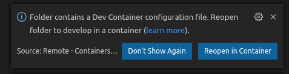

# devcontainer-universal-template

Development Docker container for VS&nbsp;Code based on the Codespaces universal development environment.

## You probably don't need to use this

You're welcome to use this template for building software with VS Code in a Docker
container, but please do check out the documentation here first.

<https://code.visualstudio.com/docs/remote/remote-overview>

<https://code.visualstudio.com/docs/remote/containers>

<https://visualstudio.microsoft.com/services/visual-studio-codespaces/>

## Overview

This repository has a ```.devcontainer``` folder which is used by VS Code to create a
containerized development environment.  The Docker image used as a starting point is
Microsoft's *universal* image which is the basis of their cloud based *Codespaces*
product.

Please note that the VS&nbsp;Code Remote Development extension provides many sample containers that might better meet your needs, so do take a look there too.

My motivation for this project was to create an offline alternative to *Codespaces*, and
it does achieve that.  Note that it's no longer my intention that it be an exact facsimile
of the *Codespaces* development environment.

## Getting started

Please do read the excellent VS&nbsp;Code documentation in the links above.

1. Install [VS&nbsp;Code](https://code.visualstudio.com/)

1. Install [Docker](https://docs.docker.com/get-docker/)

1. Install the [Remote Development extension pack](https://marketplace.visualstudio.com/items?itemName=ms-vscode-remote.vscode-remote-extensionpack)

1. Clone or download this project

1. Open the project folder (File -> Open Folder...)

1. You should be prompted to reopen the folder in a development container  
  
If the dialog doesn't appear, or disappears before you click, simply click on the  in the bottom left corner, and select **Remote-Containers: Reopen in Container**.

1. Add your code.  
There's no need to install Python, Node, Java, etc. as these are already included in the container. See the ```app``` folder for a simple Python web server example.  Note that port forwarding ensures you can access your server.

## Resources

[code.visualstudio.com/docs/remote/containers](https://code.visualstudio.com/docs/remote/containers)

[github.com/microsoft/vscode-dev-containers](https://github.com/microsoft/vscode-dev-containers)
